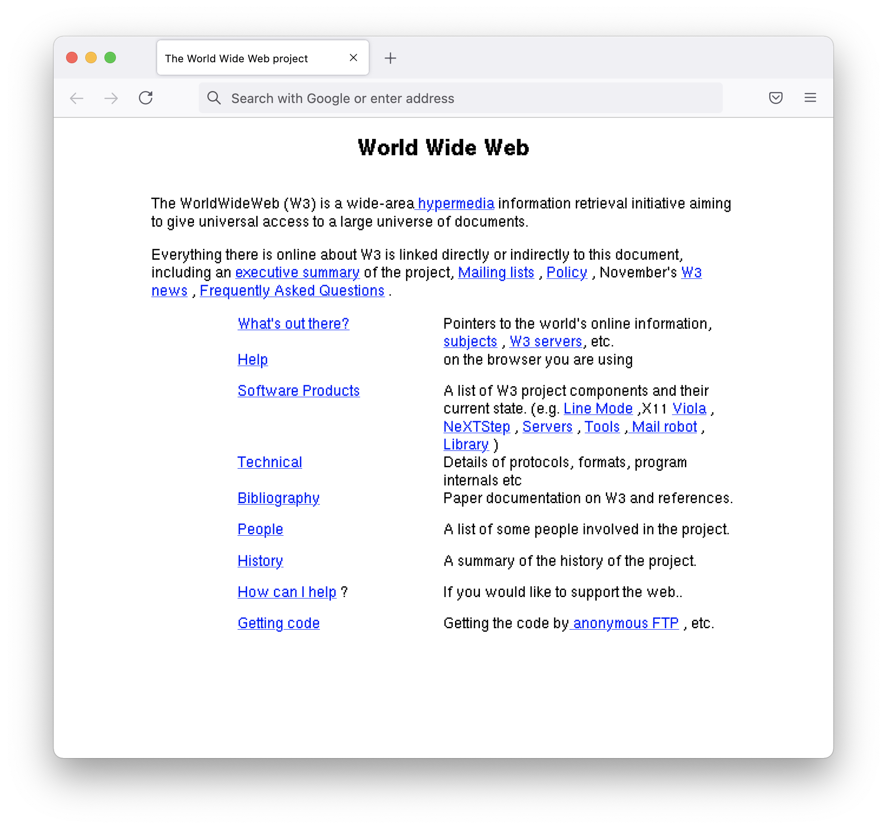

# WorldWideWeb-style
> See the web as TimBL intended it!

This is a light CSS reproduction of the stylesheet in Tim Berners-Lee's WorldWideWeb/Nexus 2.02 that you can implement on your own pages.

[See a sample page here.](https://tweedyf.github.io/WorldWideWeb-style/)

## Installation

**Two versions of the stylesheet are available: one using `px` values everywhere, and a second using `pt` values for font-related sizing and spacing.**

* Copy the <code>styles</code> directory into your web directory
* Link one of the stylesheets in your HTML code:

`<link rel="stylesheet" type="text/css" href="styles/styles.css">` 

or 

`<link rel="stylesheet" type="text/css" href="styles/styles-pt.css">` 

* You can also hotlink from Github Pages:

`<link rel="stylesheet" type="text/css" href="https://tweedyf.github.io/WorldWideWeb-style/styles/styles.css">` 

or 

`<link rel="stylesheet" type="text/css" href="https://tweedyf.github.io/WorldWideWeb-style/styles/styles-pt.css">`

## Options

* Retro fonts (reproduced using the actual NeXTStep font files) can be turned on or off; the font files are included in the code directory. (Credit to the [WorldWideWeb Rebuild](https://worldwideweb.cern.ch/typography/) team.)
     * The fonts are Helvetica and [Ohlfs](https://github.com/AlexHorovitz/Ohlfs-font-to-ttf-conversion)
* Likewise, TimBL's original horizontal rule image file is used for `hr` elements, but if you turn that off, you'll get the modern equivalent (a CSS-computed gradient) instead.

## How

The stylesheet was built using pixel values taken from `default.style` in `Nexus.app`. I've hard-coded them for a 505px-wide body (the default width of a Nexus browser window) but also converted to percentages for smaller screen widths.

## Why

For retro fun! And because it's a really elegant stylesheet.

## Notes

* Earlier versions of WorldWideWeb made anything that appeared before the first H2 element span the full page width (as in the screenshot above). Personally, I think this looks nice. If you want to "enable" this, I've styled HEADER, FOOTER, and .fullwidth to behave this way.
* WorldWideWeb and other early browsers don't understand `br`, so the best way to put lines of text in a row without putting them in a list is to have `dt` elements without corresponding `dd` elements. You can do that here, but if you do, you'll need to add an empty `dt` before your first real one so that your text spans the width of the container correctly. This is because of the CSS rule I've used to distinguish `dt`+`dd` pairs (which split the width) from singleton `dt` elements (which use it all). I'm sorry!

* The stylesheet optionally implements the horizontal rule image included in Nexus.app for `hr` elements. That image is in TIFF format, which may not work in all browsers, so you may want to convert it to another image format. (The TIFF remains in this distribution for historical fidelity.) 

  Here it is: 

## See also

* [The original style sheet (not css)](default.style)
* [The original HTML spec](http://info.cern.ch/hypertext/WWW/MarkUp/Tags.html)
